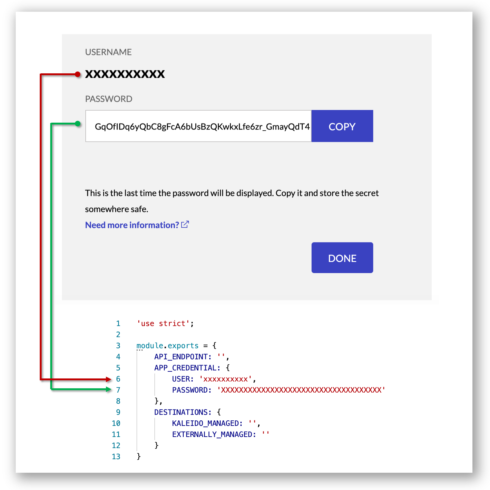
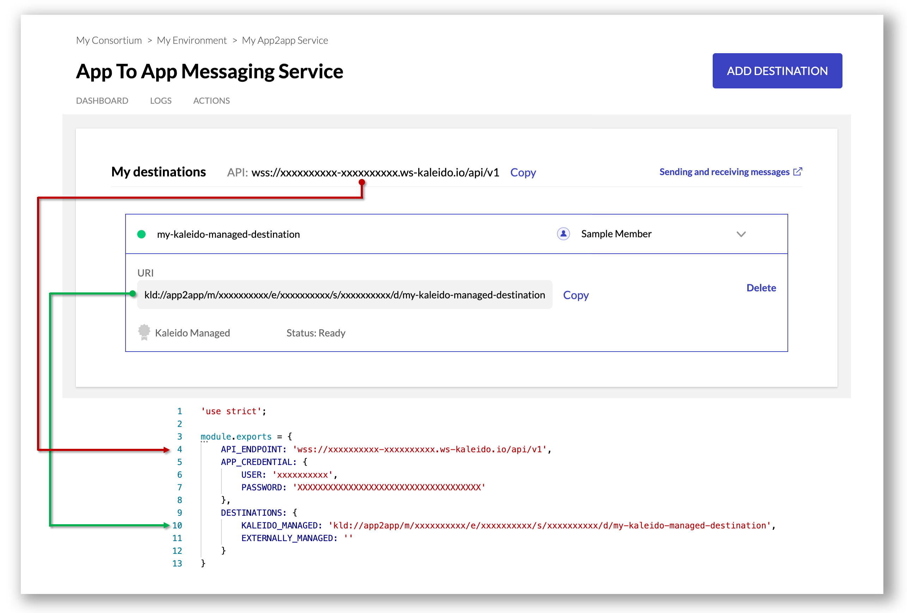
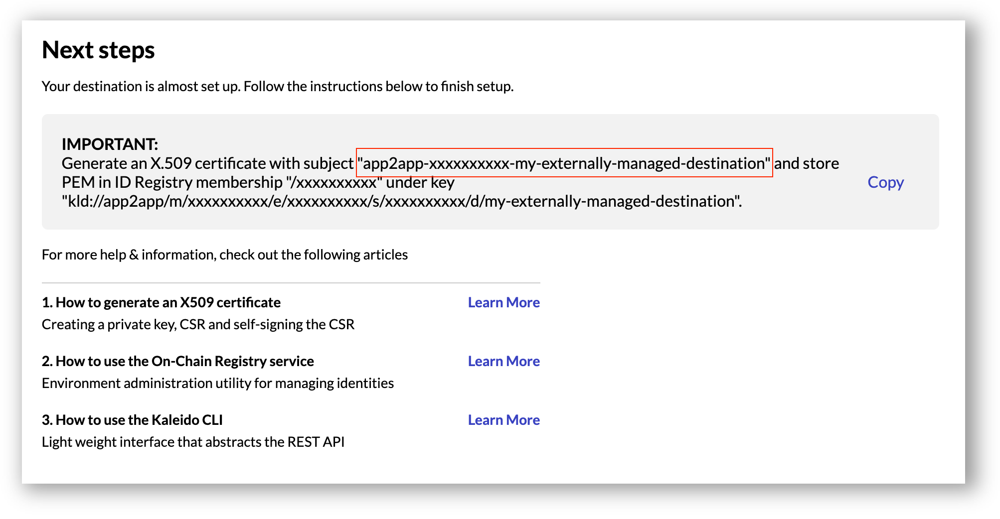

# App2app Snippets

## Introduction
This repository contains a set of code snippets written in **NodeJS** illustrating how to programmatically interact with the Kaleido App2app Messaging service. The snippets include:

- [Producing messages](#producing-messages)
- [Consuming messages](#consuming-messages)

By default consumed messages are automatically committed. It is possible to manually commit messages:

- [Consuming messages using manual commit](#consuming-messages-using-manual-commit)

Producer and consumer identities are securely stored on-chain. All messages are digitally signed and encrypted. Private keys can optionally be externally managed:

- [Producing messages with externally managed keys](#producing-messages-with-externally-managed-keys)
- [Consuming messages with externally managed keys](#consuming-messages-with-externally-managed-keys)

Consumers with externally managed keys can also optionally use manual commit:

- [Consuming messages with externally managed keys using manual commit](#consuming-messages-with-externally-managed-keys-using-manual-commit)

Message senders and receivers are uniquely identified using **destinations URIs**. These can be accessed from the App2app service dasboard. They can also be retrieved programmatically using the following API:

- [Address book](#address-book)

For more information about the Kaleido App2app Messaging service, visit the [documentation](https://docs.kaleido.io/kaleido-services/app2app/).

## Getting Started

1. Ensure prerequisites are installed: [Git](https://git-scm.com/), [NodeJS](https://nodejs.org/) and [npm](https://www.npmjs.com/).
2. Clone this repository and install dependencies by running `npm install`.
3. Login to the Kaleido console: https://console.kaleido.io/login. If this is your first time using Kaleido you can register for free here: https://console.kaleido.io/login/signup.
4. Create a consortium and an environment with at least one node (any protocol). Detailed information on completing these steps can be found here: https://docs.kaleido.io/using-kaleido/quick-start.
4. On the environment screen, click on **Add** and select **New Application Credentials**. Click on **Next** and copy the credentials into [./lib/common.js](./lib/common.js) as follows:



5. Click on **Add** and select **Add Services**. Select **App to app Messaging Service** and click on **Add**.
6. Look for the **App to app Messaging Service** entry under **Member Services** and click on it when the status icon turns green.
7. Click on **Add Destination**. On the next screen click on **Let Kaleido Register my Org On-Chain**. Type `my-kaleido-managed-destination` on the destination name input field. Finally, click on **Finish**.
8. Copy the API Endpoint and destination URI into [./lib/common.js](./lib/common.js) as follows:



>  In a practical application destinations would correspond to App2app service instances belonging to different organizations. In this example we are using a single service instance and a single destination just for illustration/test purposes.

> Note: the remaining steps are only required when using externally managed private keys

8. Click on **Add Destination** one more time. Then click on **Next** and type `my-externally-managed-destination` on the destination name input field.
9. Check **I would like to encrypt and sign messages using my own private key, not managed by Kaleido** option and click on **Finish**.
10. To generate a private key and a self-signed X.509 certificate run the following command passing the **subject** value shown on screen:
```sh
cd lib/externally-managed/cert
./generate-certs.sh app2app-xxxxxxxxxx-my-externally-managed-destination
```
11. Copy the **key** value shown on screen. Use the breadcrum to return to the environment screen and click on **On-Chain Registry** under **services**.
12. Select your membership on the left hand side tree and click on **Add Profile Key**. Paste the key copied in the previous step into the **Key Name** input field.
13. Copy the content of [./lib/externally-managed-cert-cert.pem](./lib/externally-managed-cert-cert.pem) and paste it into the **Value** input field. Finally, click on **Add**.
14. Use the breadcrum to return to the environment screen and click on **App to app Messaging Service** under **Member Services**.
15. Copy the externally managed destination URI into [./lib/externally-managed-cert-cert.pem](./lib/externally-managed-cert-cert.pem) as follows:



# Snippets

## Producing messages

### Sample code

```Javascript
'use strict';

const common = require('../common');

const socket = require('socket.io-client').connect(common.API_ENDPOINT,
  {
    extraHeaders: {
      Authorization: 'Basic ' + Buffer.from(common.APP_CREDENTIAL.USER +
        ':' + common.APP_CREDENTIAL.PASSWORD).toString('base64')
    }
  })
  .on('connect', () => {
    console.log('Producer connected.');
    send();
  }).on('delivery-report', data => {
    console.log('Delivery report key: ' + data.key.toString() + ', timestamp: ' + data.timestamp);
  }).on('disconnect', () => {
    console.log('Producer disconnected.');
  }).on('exception', exception => {
    console.log('Exception: ' + exception);
  }).on('error', err => {
    console.log('Error: ' + err);
  }).on('connect_error', err => {
    console.log('Connection error: ' + err);
  });

function send() {
  socket.emit('produce', {
    headers: {
      from: common.DESTINATIONS.KALEIDO_MANAGED,
      to: common.DESTINATIONS.KALEIDO_MANAGED,
    }
    , content: 'Testing 1-2-3'
  },
    'samplekey',
    err => {
      if (err) {
        console.log('Delivery error: ' + err);
      }
    });
}
```

### Sample output

```
Producer connected.
Delivery report key: samplekey, timestamp: 1574046821873
```

To run the sample code: `npm run producer`

## Consuming messages

### Sample code

```Javascript
'use strict';

const common = require('../common');

const socket = require('socket.io-client').connect(common.API_ENDPOINT,
  {
    extraHeaders: {
      Authorization: 'Basic ' + Buffer.from(common.APP_CREDENTIAL.USER +
        ':' + common.APP_CREDENTIAL.PASSWORD).toString('base64')
    }
  })
  .on('connect', () => {
    console.log('Consumer connected.')
    socket.emit('subscribe', [common.DESTINATIONS.KALEIDO_MANAGED], (err, result) => {
      if (err) {
        console.log(err);
      } else {
        console.log(result);
      }
    });
  }).on('disconnect', () => {
    console.log('Consumer disconnected.');
  }).on('exception', exception => {
    console.log('Exception: ' + exception);
  }).on('error', err => {
    console.log('Error: ' + err);
  }).on('connect_error', err => {
    console.log('Connection error: ' + err);
  }).on('data', (message, key, timestamp) => {
    console.log('Message from: ' + message.headers.from);
    console.log('Content: ' + message.content);
    console.log('key: ' + key);
    console.log('timestamp: ' + timestamp);
  });
```

### Sample output

```
Consumer connected.
Subscribed.
Message from: kld://app2app/m/xxxxxxxxxx/e/xxxxxxxxxx/s/xxxxxxxxxx/d/my-kaleido-managed-destination
Content: Testing 1-2-3
key: samplekey
timestamp: 1574046262874
```

To run the sample code: `npm run consumer-auto-commit`

## Consuming messages using manual commit

### Sample code

```Javascript
'use strict';

const common = require('../common');

const socket = require('socket.io-client').connect(common.API_ENDPOINT + '?auto_commit=false',
  {
    extraHeaders: {
      Authorization: 'Basic ' + Buffer.from(common.APP_CREDENTIAL.USER +
        ':' + common.APP_CREDENTIAL.PASSWORD).toString('base64')
    }
  })
  .on('connect', () => {
    console.log('Consumer connected.')
    socket.emit('subscribe', [common.DESTINATIONS.KALEIDO_MANAGED], (err, result) => {
      if (err) {
        console.log(err);
      } else {
        console.log(result);
      }
    });
  }).on('disconnect', () => {
    console.log('Consumer disconnected.');
  }).on('exception', exception => {
    console.log('Exception: ' + exception);
  }).on('error', err => {
    console.log('Error: ' + err);
  }).on('connect_error', err => {
    console.log('Connection error: ' + err);
  }).on('data', (message, key, timestamp) => {
    console.log('Message from: ' + message.headers.from);
    console.log('Content: ' + message.content);
    console.log('key: ' + key);
    console.log('timestamp: ' + timestamp);
    socket.emit('commit');
    console.log('Commit emitted')
  });
```

### Sample output
```
Consumer connected.
Subscribed.
Message from: kld://app2app/m/xxxxxxxxxx/e/xxxxxxxxxx/s/xxxxxxxxxx/d/my-kaleido-managed-destination
Content: Testing 1-2-3
key: samplekey
timestamp: 1574047697978
Commit emitted.
```

### Notes
- The boolean query string **auto-commit** must be **false** to enable manual commit
- The **commit** event must be emitted after messages are consumed

To run the sample code: `npm run consumer-manual-commit`

## Producing messages with externally managed keys

### Sample code

```Javascript
'use strict';

const fs = require('fs');
const common = require('../common');

const socket = require('socket.io-client').connect(common.API_ENDPOINT,
  {
    extraHeaders: {
      Authorization: 'Basic ' + Buffer.from(common.APP_CREDENTIAL.USER +
        ':' + common.APP_CREDENTIAL.PASSWORD).toString('base64')
    }
  })
  .on('connect', () => {
    console.log('Producer connected.');
    send();
  }).on('delivery-report', data => {
    console.log('Delivery report key: ' + data.key.toString() + ', timestamp: ' + data.timestamp);
  }).on('disconnect', () => {
    console.log('Producer disconnected.');
  }).on('exception', exception => {
    console.log('Service reported an exception: ' + exception);
  }).on('error', err => {
    console.log('Error: ' + err);
  }).on('connect_error', err => {
    console.log('Connection error: ' + err);
  });

function send() {
  const content = 'Testing 1-2-3'
  const producerPrivateKeyPEM = fs.readFileSync(__dirname + '/cert/key.pem', {encoding: 'UTF-8'});
  const signature = require('crypto').createSign('RSA-SHA256').update(content).sign(producerPrivateKeyPEM);
  socket.emit('produce', {
    headers: {
      from: common.DESTINATIONS.EXTERNALLY_MANAGED,
      to: common.DESTINATIONS.EXTERNALLY_MANAGED,
      signature
    }
    , content
  },
    'samplekey',
    err => {
      if (err) {
        console.log('Delivery error: ' + err);
      }
    });
}
```

### Sample output
```
Producer connected.
Delivery report key: samplekey, timestamp: 1574048228167
```

### Notes

- When producing messages with externally managed keys, the **produce** event must include the RSA-SHA256 signature of the content

To run the sample code: `npm run producer-externally-managed-key`

## Consuming messages with externally managed keys

### Sample code

```Javascript
'use strict';

const fs = require('fs');
const common = require('../common');

const socket = require('socket.io-client').connect(common.API_ENDPOINT,
  {
    extraHeaders: {
      Authorization: 'Basic ' + Buffer.from(common.APP_CREDENTIAL.USER + ':' +
        common.APP_CREDENTIAL.PASSWORD).toString('base64')
    }
  })
  .on('connect', () => {
    console.log('Consumer connected.');
    socket.emit('subscribe', [common.DESTINATIONS.EXTERNALLY_MANAGED], (err, result) => {
      if (err) {
        console.log(err);
      } else {
        console.log(result);
      }
    });
  }).on('disconnect', () => {
    console.log('Consumer disconnected.');
  }).on('exception', exception => {
    console.log('Exception: ' + exception);
  }).on('error', err => {
    console.log('Error: ' + err);
  }).on('connect_error', err => {
    console.log('Connection error: ' + err);
  }).on('data', (pkcs7Envelope, key, timestamp) => {

    const forge = require('node-forge');
    const pkcs7 = forge.pkcs7.messageFromPem(pkcs7Envelope);
    const consumerPrivateKeyPEM = fs.readFileSync(__dirname + '/cert/key.pem', { encoding: 'UTF-8' });
    pkcs7.decrypt(pkcs7.recipients[0], forge.pki.privateKeyFromPem(consumerPrivateKeyPEM));
    const message = JSON.parse(pkcs7.content.toString());
    console.log('Message: ' + message.content);
    console.log('Key: ' + key + ', timestamp: ' + timestamp);

    const producerCertPEM = fs.readFileSync(__dirname + '/cert/cert.pem', { encoding: 'UTF-8' });
    console.log('Signature checks out: ' +
      require('crypto').createVerify('RSA-SHA256')
        .update(message.content)
        .verify(producerCertPEM,
          Buffer.from(message.headers.signature)));
  });
```

### Sample output
```
Consumer connected.
Subscribed.
Message: Testing 1-2-3
Key: samplekey, timestamp: 1574048584762
Signature checks out: true
```

### Notes
- When using externally managed keys consumers receive a PKCS7 payload which needs to be decrypted with the private key.
  In addition, consumers are responsible for verifying the signature of the sender. For this the sender public key can be
  obtain from the On-Chain registry X.509 certificate associated with the producer destination URI.

To run the sample code: `npm run consumer-externally-managed-key-auto-commit`

## Consuming messages with externally managed keys using manual commit

### Sample code

```Javascript
'use strict';

const fs = require('fs');
const common = require('../common');

const socket = require('socket.io-client').connect(common.API_ENDPOINT + '?auto_commit=false',
  {
    extraHeaders: {
      Authorization: 'Basic ' + Buffer.from(common.APP_CREDENTIAL.USER + ':' +
        common.APP_CREDENTIAL.PASSWORD).toString('base64')
    }
  })
  .on('connect', () => {
    console.log('Consumer connected.');
    socket.emit('subscribe', [common.DESTINATIONS.EXTERNALLY_MANAGED], (err, result) => {
      if (err) {
        console.log(err);
      } else {
        console.log(result);
      }
    });
  }).on('disconnect', () => {
    console.log('Consumer disconnected.');
  }).on('exception', exception => {
    console.log('Exception: ' + exception);
  }).on('error', err => {
    console.log('Error: ' + err);
  }).on('connect_error', err => {
    console.log('Connection error: ' + err);
  }).on('data', (pkcs7Envelope, key, timestamp) => {

    const forge = require('node-forge');
    const pkcs7 = forge.pkcs7.messageFromPem(pkcs7Envelope);
    const consumerPrivateKeyPEM = fs.readFileSync(__dirname + '/cert/key.pem', { encoding: 'UTF-8' });
    pkcs7.decrypt(pkcs7.recipients[0], forge.pki.privateKeyFromPem(consumerPrivateKeyPEM));
    const message = JSON.parse(pkcs7.content.toString());
    console.log('Message: ' + message.content);
    console.log('Key: ' + key + ', timestamp: ' + timestamp);

    const producerCertPEM = fs.readFileSync(__dirname + '/cert/cert.pem', { encoding: 'UTF-8' });
    console.log('Signature checks out: ' +
      require('crypto').createVerify('RSA-SHA256')
        .update(message.content)
        .verify(producerCertPEM,
          Buffer.from(message.headers.signature)));
    socket.emit('commit');
    console.log('Commit emitted.');
  });
```

### Sample response
```
Consumer connected.
Subscribed.
Message: Testing 1-2-3
Key: samplekey, timestamp: 1574048923060
Signature checks out: true
Commit emitted.
```

To run the sample code: `npm run consumer-externally-managed-key-manual-commit`

## Address book

### Sample code

```Javascript
'use strict';

const axios = require('axios');
const common = require('./common');

const REST_API_ENDPOINT = 'https' + common.API_ENDPOINT.substr(3);

axios({
    url: REST_API_ENDPOINT + '/addressbook',
    auth: {
      username: common.APP_CREDENTIAL.USER,
      password: common.APP_CREDENTIAL.PASSWORD
    }
}).then(response => {
  console.log(JSON.stringify(response.data, null, 2));
}).catch(err => {
  console.log('Failed to access address book: ' + err);
});
```

### Sample output
```JSON
[
    {
        "membership": "/xxxxxxxxxx",
        "destinations": [
            {
                "uri": "kld://app2app/m/xxxxxxxxxx/e/xxxxxxxxxx/s/xxxxxxxxxx/d/my-kaleido-managed-destination",
                "name": "my-kaleido-managed-destination"
            },
            {
                "uri": "kld://app2app/m/xxxxxxxxxx/e/xxxxxxxxxx/s/xxxxxxxxxx/d/my-externally-managed-destination",
                "name": "my-externally-managed-destination"
            }
        ]
    }
]
```